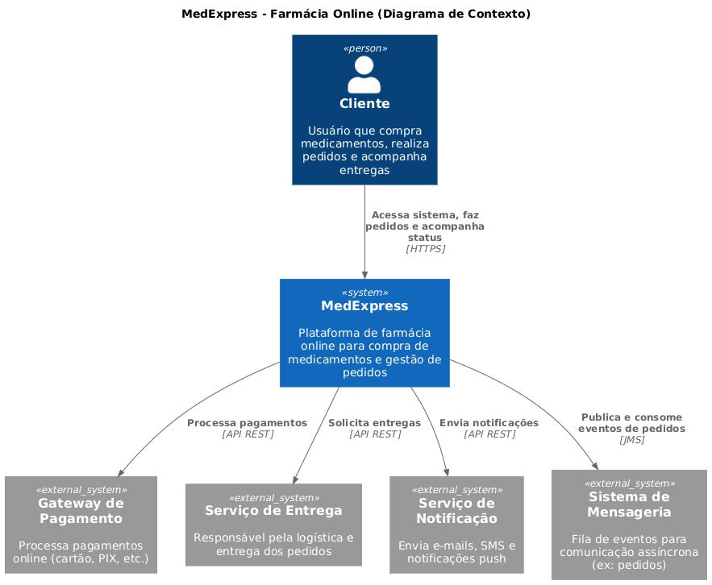
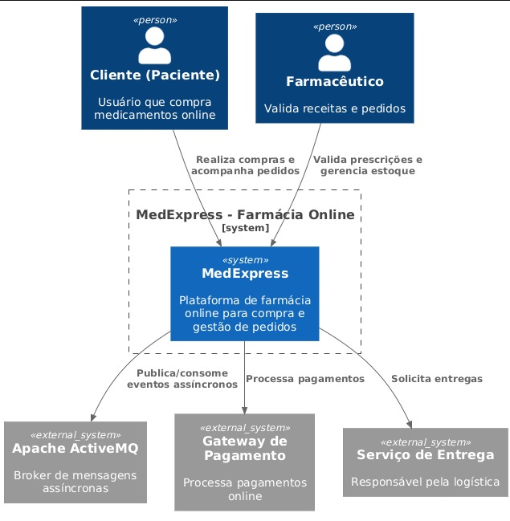

# 💊 MedExpress

Sistema de farmácia online com rastreamento de pedidos em tempo real, desenvolvido com foco em arquitetura distribuída e processamento assíncrono.

---

## 📌 Sobre o projeto

O **MedExpress** é uma plataforma de e-commerce farmacêutico onde usuários podem navegar livremente pelos produtos sem a necessidade de login.

A autenticação é opcional e exigida apenas para ações sensíveis, como:

- Finalização de compras  
- Acompanhamento de pedidos  
- Operações relacionadas ao usuário  

Essa abordagem melhora a experiência do usuário, permitindo acesso rápido ao catálogo sem barreiras iniciais.

---

## 🚀 Funcionalidades

- Navegação de produtos sem login  
- Cadastro e autenticação de usuários  
- Criação de pedidos  
- Rastreamento de pedidos em tempo real  

### 📦 Status dos pedidos:
- PROCESSANDO  
- ENVIADO  
- ENTREGUE  

---

## 🧠 Arquitetura do Sistema

O sistema foi projetado com base em duas abordagens principais:

---

### 🔷 Arquitetura Hexagonal (Ports and Adapters)

A aplicação é organizada de forma que o núcleo (regras de negócio) seja independente de tecnologias externas.

- O **core** contém as entidades e regras (Pedido, Produto, Usuário)  
- As interações externas são feitas por meio de **ports (interfaces)**  
- As implementações são feitas por **adapters (API, banco, mensageria)**  

#### ✔ Benefícios:
- Baixo acoplamento  
- Facilidade de manutenção  
- Flexibilidade tecnológica  

---

### 🔶 Arquitetura Event-Driven

O sistema utiliza processamento orientado a eventos, permitindo que os pedidos sejam tratados de forma assíncrona.

#### 🔄 Fluxo:

Cliente realiza pedido  
→ Evento de pedido é publicado  
→ Enviado para fila  
→ Worker consome  
→ Processa pedido  
→ Novo evento de status  
→ Atualização no frontend  

#### ✔ Benefícios:
- Desacoplamento entre componentes  
- Escalabilidade  
- Processamento não bloqueante  

---

## 🏗️ Componentes do Sistema

- **Frontend** → Interface do usuário  
- **Backend API** → Regras de negócio  
- **Broker (ActiveMQ)** → Fila de mensagens  
- **Worker** → Processamento assíncrono  
- **WebSocket** → Atualização em tempo real  

---

## 🛠️ Tecnologias

- Java  
- Spring Boot  
- React  
- ActiveMQ  
- WebSocket  
- Docker  
- Git  

---

## 🎨 Protótipo (Figma)

O design da interface foi desenvolvido no Figma, incluindo as principais telas do sistema:

- Página inicial (catálogo de produtos)  
- Tela de login/cadastro  
- Fluxo de navegação entre telas  

👉 [Acessar protótipo](https://www.figma.com/site/0UWqvwXKueswp96giWlsnh/Prot%C3%B3tipo-Figma---MedExpress?node-id=0-1&t=N9Xlb3XNffvtx5n0-1)

## 📦 Estrutura do projeto
│
├── frontend/
├── backend/
├── worker/
├── docker/
├── README.md
├── .gitignore

---

## 🏅 Qualidade

### 📄 Plano de Testes

O sistema **MedExpress** será validado por meio de testes funcionais e não funcionais, garantindo que todas as funcionalidades operem corretamente e atendam aos requisitos definidos.

#### 🎯 Objetivo
Garantir que o sistema:
- Funcione corretamente para o usuário final
- Seja confiável e seguro
- Suporte múltiplos acessos simultâneos
- Entregue uma boa experiência de uso

---

### 🧪 Cenários de Teste

#### 🔐 Autenticação
- Login com dados válidos → deve autenticar
- Login com dados inválidos → deve exibir erro
- Cadastro de novo usuário → deve criar conta com sucesso

#### 🛍️ Navegação de Produtos
- Acessar catálogo sem login → deve funcionar normalmente
- Visualizar detalhes de um produto → deve exibir informações corretas

#### 🛒 Carrinho e Pedido
- Adicionar produto ao carrinho → deve incrementar corretamente
- Remover produto → deve atualizar o carrinho
- Finalizar compra sem login → deve solicitar autenticação
- Finalizar compra logado → deve criar pedido

#### 📦 Rastreamento de Pedido
- Pedido criado → status inicial **PROCESSANDO**
- Atualização via sistema → status muda para **ENVIADO**
- Entrega finalizada → status **ENTREGUE**
- Atualização em tempo real → frontend deve refletir mudanças

#### 🔄 Processamento Assíncrono
- Envio de pedido → evento deve ser publicado
- Evento enviado para fila → deve ser processado
- Worker consome mensagem → pedido processado corretamente
- Atualização de status → refletida no sistema

---

### ⚙️ Requisitos Não-Funcionais

#### 🚀 Performance
- O sistema deve responder em até **2 segundos**
- Deve suportar múltiplos usuários simultâneos

#### 🔒 Segurança
- Dados sensíveis devem ser protegidos
- Autenticação obrigatória para operações críticas
- Uso de HTTPS em ambiente de produção

#### 📈 Escalabilidade
- Sistema preparado para crescimento de usuários
- Uso de mensageria (**ActiveMQ**) para processamento assíncrono

#### 🔄 Disponibilidade
- Sistema deve ter alta disponibilidade
- Falhas no backend não devem impactar o frontend

#### 🔧 Manutenibilidade
- Arquitetura baseada em **Hexagonal Architecture**
- Baixo acoplamento entre componentes
- Facilidade de manutenção e evolução

#### 🌐 Usabilidade
- Interface simples e intuitiva
- Navegação sem necessidade de login
- Feedback visual claro ao usuário
  
---

#### 🚀Subindo o ActiveMQ com Docker

Execute o comando abaixo para iniciar o broker de mensageria:

docker run -d \
  -p 8161:8161 \
  -p 61616:61616 \
  --name activemq \
  rmohr/activemq

## 📊 Diagramas da Arquitetura

### 🔹 Contexto (C4 - Nível 1)
Representa a visão geral do sistema e sua interação com usuários e sistemas externos.

---

### 🔹 Containers (C4 - Nível 2)
Mostra os principais blocos da aplicação, como serviços, APIs e banco de dados.

---

### 🔹 Componentes / Classes (C4 - Nível 3)
Detalha a estrutura interna do sistema, incluindo classes e responsabilidades.

