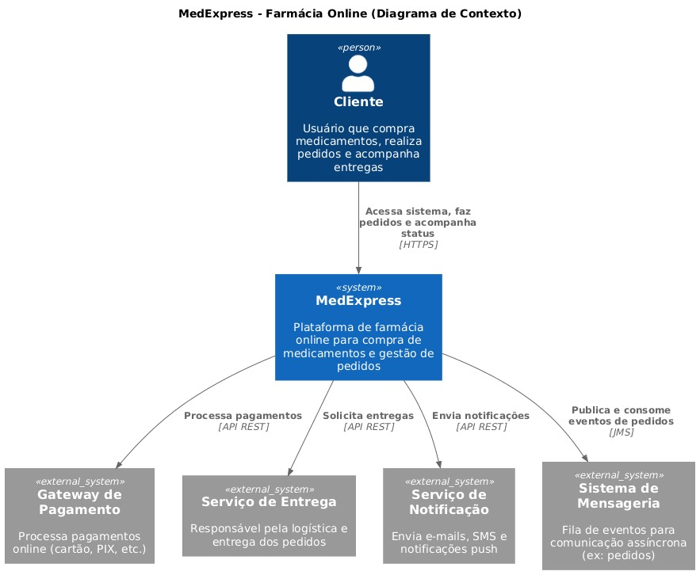
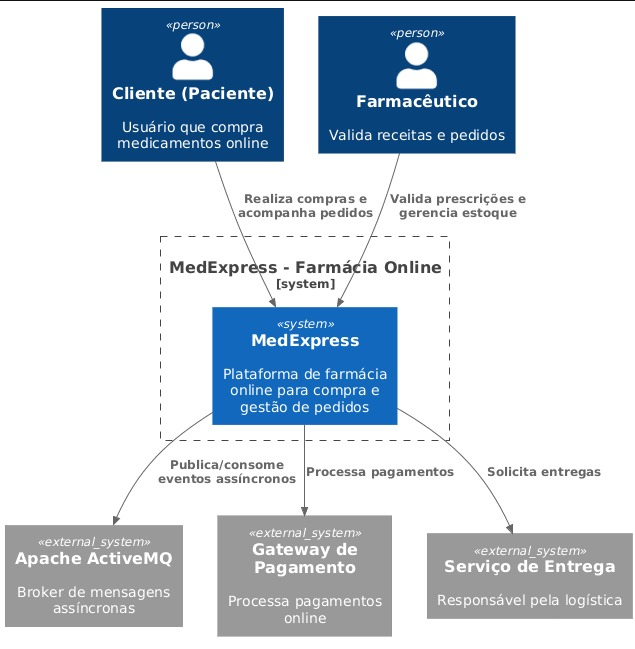
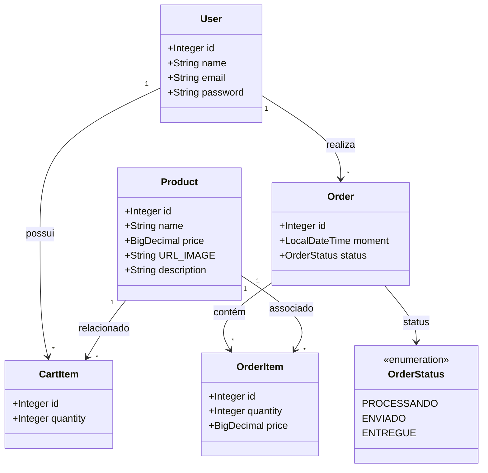

# 💊 MedExpress

Sistema de farmácia online com rastreamento de pedidos em tempo real, desenvolvido com foco em arquitetura distribuída e processamento assíncrono.

---

# 📌 Sobre o Projeto

O **MedExpress** é uma plataforma de e-commerce farmacêutico onde usuários podem navegar livremente pelos produtos sem a necessidade de login.

A autenticação é opcional e exigida apenas para ações sensíveis, como:

- Finalização de compras
- Acompanhamento de pedidos
- Operações relacionadas ao usuário

Essa abordagem melhora a experiência do usuário, permitindo acesso rápido ao catálogo sem barreiras iniciais.

---

# 🚀 Funcionalidades

- Navegação de produtos sem login
- Cadastro e autenticação de usuários
- Criação de pedidos
- Rastreamento de pedidos em tempo real

## 📦 Status dos Pedidos

- `PROCESSANDO`
- `ENVIADO`
- `ENTREGUE`

---

# 🧠 Arquitetura do Sistema

O sistema foi projetado utilizando duas abordagens principais:

---

## 🔷 Arquitetura Hexagonal (Ports and Adapters)

A aplicação é organizada de forma que o núcleo do sistema seja independente de tecnologias externas.

### Estrutura

- O **Core** contém:
  - Entidades
  - Casos de uso
  - Regras de negócio

- As integrações externas acontecem através de:
  - **Ports (interfaces)**
  - **Adapters (implementações)**

### ✔ Benefícios

- Baixo acoplamento
- Alta manutenibilidade
- Facilidade de testes
- Flexibilidade tecnológica

---

## 🔶 Arquitetura Event-Driven

O sistema utiliza processamento orientado a eventos para permitir comunicação assíncrona entre os componentes.

## 🔄 Fluxo do Pedido

```text
Cliente realiza pedido
        ↓
Evento de pedido publicado
        ↓
ActiveMQ recebe mensagem
        ↓
Worker consome evento
        ↓
Pedido processado
        ↓
Novo evento de status
        ↓
Frontend atualizado em tempo real
```

### ✔ Benefícios

- Desacoplamento entre serviços
- Escalabilidade
- Processamento não bloqueante
- Melhor tolerância a falhas

---

# 🏗️ Componentes do Sistema

| Componente | Responsabilidade |
|---|---|
| Frontend | Interface do usuário |
| Backend API | Regras de negócio |
| PostgreSQL | Persistência de dados |
| ActiveMQ | Broker de mensageria |
| Worker | Processamento assíncrono |
| WebSocket | Atualização em tempo real |

---

# 🛠️ Tecnologias

- Java
- Spring Boot
- React
- PostgreSQL
- ActiveMQ
- WebSocket
- Docker
- Git

---

# 🎨 Protótipo (Figma)

O design da interface foi desenvolvido no Figma, incluindo:

- Página inicial
- Catálogo de produtos
- Login e cadastro
- Fluxo de navegação

👉 [Acessar Protótipo](https://www.figma.com/site/vf9dDm9gXnqdLLtdXOuwW3/Prot%C3%B3tipo-Figma---MedExpress--c%C3%B3pia-?node-id=2005-356&t=ybbjCbzqsBJmwQ2C-1)

---

# 📦 Estrutura do Projeto

```text
medexpress/
│
├── frontend/
├── backend/
├── worker/
├── docker/
├── docker-compose.yml
├── README.md
└── .gitignore
```

---

# 🐳 Ambiente com Docker Compose

O projeto utiliza Docker Compose para orquestrar os serviços necessários da aplicação.

## ▶️ Subindo os Serviços

Execute na raiz do projeto:

```bash
docker compose up -d
```

Ou:

```bash
docker-compose up -d
```

---

# 📄 docker-compose.yml

```yaml
services:

  # 🐘 PostgreSQL
  postgres:
    image: postgres:15-alpine
    container_name: medexpress-postgres

    environment:
      POSTGRES_DB: medexpress
      POSTGRES_USER: admin
      POSTGRES_PASSWORD: adminpassword

    ports:
      - "5432:5432"

    volumes:
      - postgres_data:/var/lib/postgresql/data

    restart: always

  # 📬 ActiveMQ
  activemq:
    image: rmohr/activemq:latest
    container_name: medexpress-activemq

    ports:
      - "61616:61616"
      - "8161:8161"

    environment:
      ACTIVEMQ_ADMIN_LOGIN: admin
      ACTIVEMQ_ADMIN_PASSWORD: adminpassword

    restart: always

# 💾 Persistência dos dados
volumes:
  postgres_data:
```

---

# 💾 Persistência de Dados

A persistência funciona através do volume Docker:

```yaml
volumes:
  - postgres_data:/var/lib/postgresql/data
```

## 🔍 Como isso funciona?

O Docker cria um volume chamado:

```text
postgres_data
```

Esse volume armazena fisicamente os dados do PostgreSQL fora do container.

### ✔ Vantagens

- Os dados não são perdidos ao reiniciar o container
- Mesmo removendo o container, os dados continuam salvos
- Facilita backup e recuperação

---

## 📂 Fluxo da Persistência

```text
Container PostgreSQL
        │
        ▼
/var/lib/postgresql/data
        │
        ▼
Volume Docker: postgres_data
        │
        ▼
Dados persistidos no host
```

---

## 🧹 Comandos Úteis

### Parar os containers

```bash
docker compose down
```

### Remover containers + volumes

```bash
docker compose down -v
```

⚠️ Esse comando remove os dados persistidos do PostgreSQL.

---

# 📬 ActiveMQ

## 🔗 Painel Administrativo

Acesse:

```text
http://localhost:8161
```

## 🔐 Credenciais

```text
Usuário: admin
Senha: adminpassword
```

---

# 📊 Diagramas da Arquitetura

## 🔹 Contexto (C4 - Nível 1)

Representa a visão geral do sistema e interação com usuários e sistemas externos.



---

## 🔹 Containers (C4 - Nível 2)

Mostra os principais blocos da aplicação.



---

## 🔹 Componentes / Classes (C4 - Nível 3)

Detalha responsabilidades internas do sistema.

📊 Diagrama de Classes


```mermaid
classDiagram

class User {
    +Integer id
    +String name
    +String email
    +String password
}

class Product {
    +Integer id
    +String name
    +BigDecimal price
    +String URL_IMAGE
    +String description
}

class CartItem {
    +Integer id
    +Integer quantity
}

class Order {
    +Integer id
    +LocalDateTime moment
    +OrderStatus status
}

class OrderItem {
    +Integer id
    +Integer quantity
    +BigDecimal price
}

class OrderStatus {
    <<enumeration>>
    PROCESSANDO
    ENVIADO
    ENTREGUE
}

User "1" --> "*" CartItem : possui
Product "1" --> "*" CartItem : relacionado

User "1" --> "*" Order : realiza

Order "1" --> "*" OrderItem : contém
Product "1" --> "*" OrderItem : associado

Order --> OrderStatus : status
```

---

# 🏅 Qualidade

## 📄 Plano de Testes

O sistema será validado por testes funcionais e não funcionais.

---

## 🧪 Cenários de Teste

### 🔐 Autenticação

- Login válido → autenticar usuário
- Login inválido → exibir erro
- Cadastro → criar conta

### 🛍️ Navegação de Produtos

- Navegar sem login
- Visualizar detalhes dos produtos

### 🛒 Carrinho e Pedido

- Adicionar produto
- Remover produto
- Finalizar compra autenticado
- Solicitar login quando necessário

### 📦 Rastreamento

- Pedido inicia como `PROCESSANDO`
- Atualização para `ENVIADO`
- Finalização em `ENTREGUE`
- Atualização em tempo real via WebSocket

### 🔄 Processamento Assíncrono

- Publicação de eventos
- Consumo via Worker
- Atualização correta do sistema

---

# ⚙️ Requisitos Não Funcionais

## 🚀 Performance

- Resposta em até 2 segundos

## 🔒 Segurança

- Proteção de dados sensíveis
- Autenticação para operações críticas

## 📈 Escalabilidade

- Arquitetura preparada para crescimento
- Uso de mensageria assíncrona

## 🔄 Disponibilidade

- Alta disponibilidade
- Tolerância a falhas

## 🔧 Manutenibilidade

- Arquitetura Hexagonal
- Baixo acoplamento
- Facilidade de evolução

## 🌐 Usabilidade

- Interface intuitiva
- Navegação sem login
- Feedback visual claro

---

# 🏗️ Visão Geral da Arquitetura

```text
    Frontend
        │
        ▼
Backend API (Spring Boot)
        │
 ┌──────┴──────┐
 ▼             ▼
PostgreSQL   ActiveMQ
                    │
                    ▼
                 Worker
                    │
                    ▼
                WebSocket
```

---

# 👨‍💻 Autor

Projeto desenvolvido para fins acadêmicos e estudo de arquitetura distribuída, mensageria e sistemas assíncronos.
